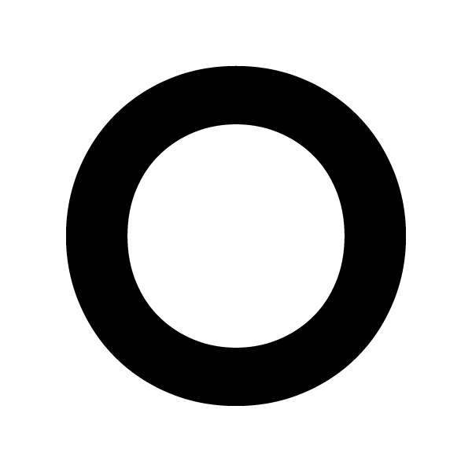

  <a href="https://monicatanios.github.io/octillect/">
    
    <h1>Octillect</h1>
  </a>
  Octillect <i>[octopus + intellect]</i> can manage tasks on project level, made for developers, used to plan workflows and organize tasks to keep your teamwork on   schedule and track the board's progress. The Application enables teams to collaborate effectively by tracking time of tasks, assigning tasks to specific team   members and tagging tasks.
   
   
  
  <h3>Developed By</h3>
  
   
   
  

